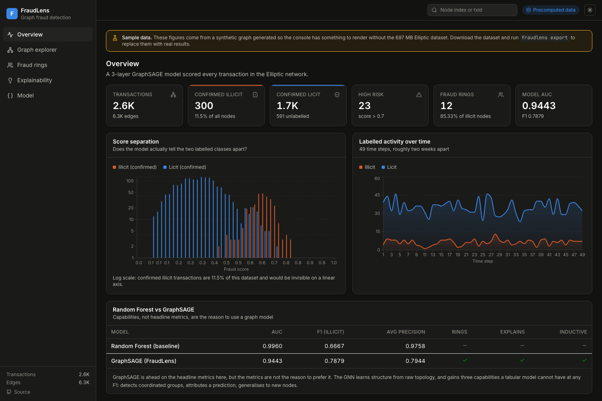
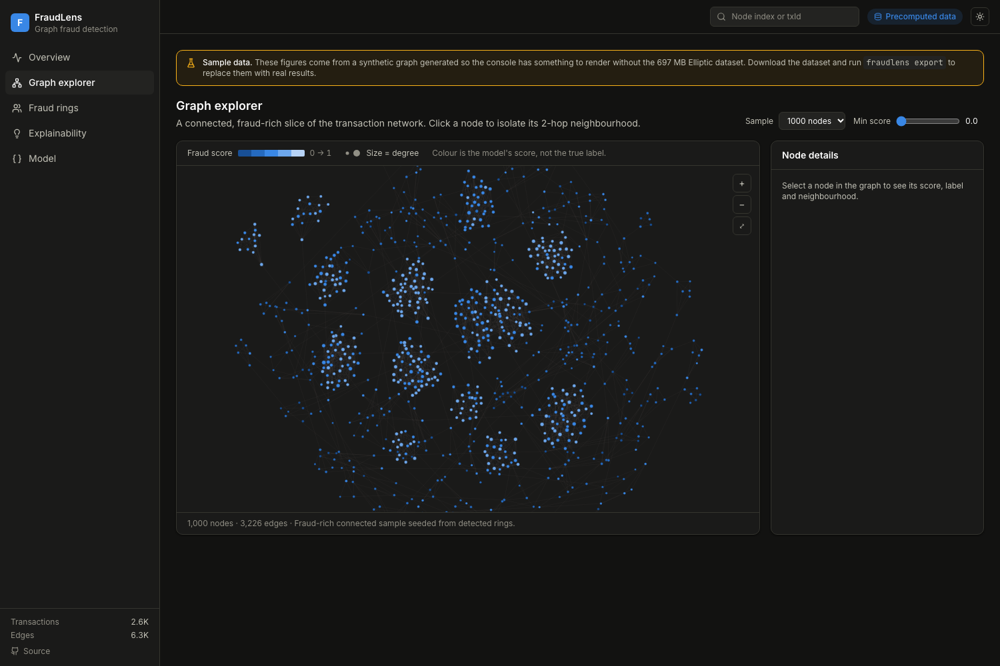
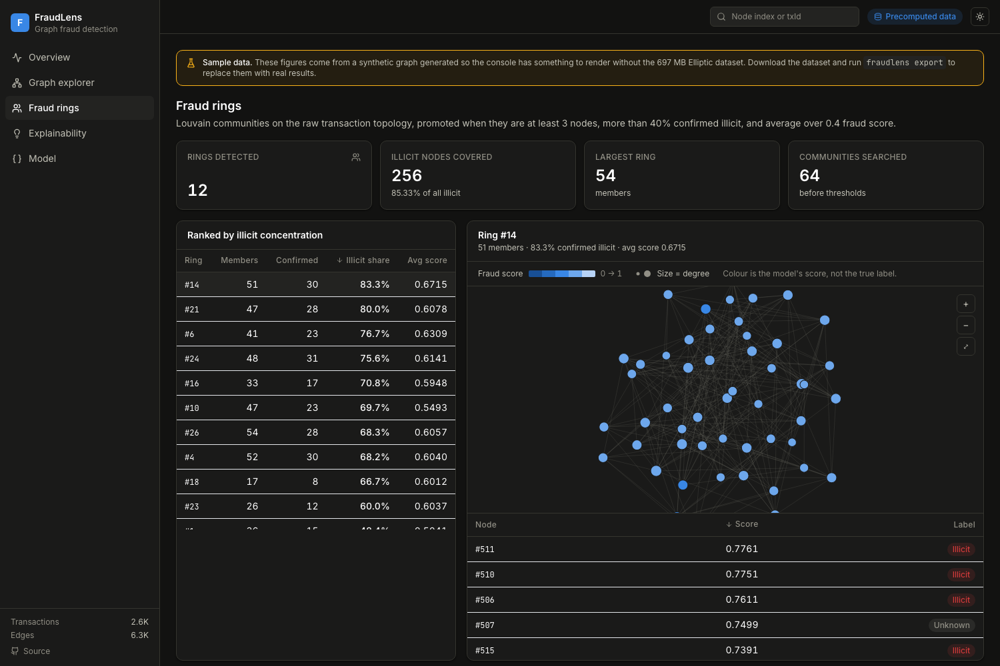
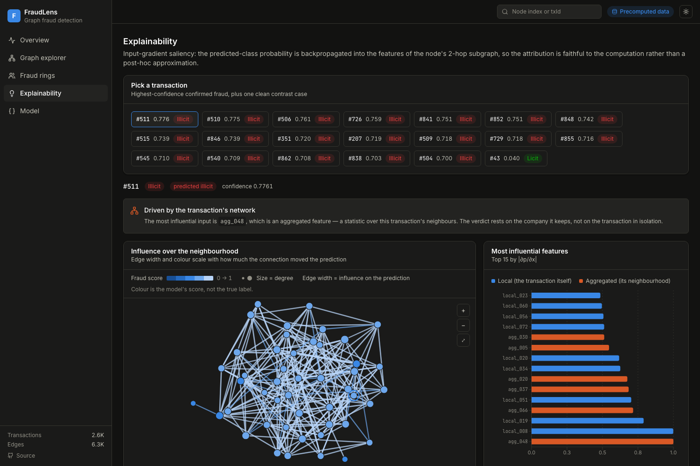
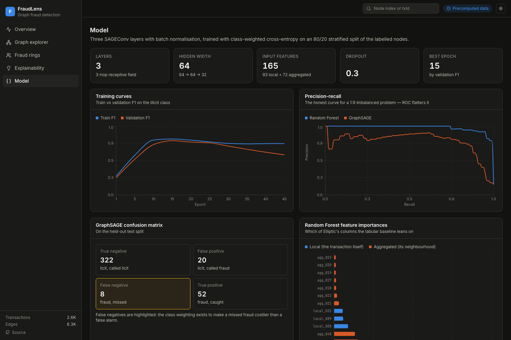
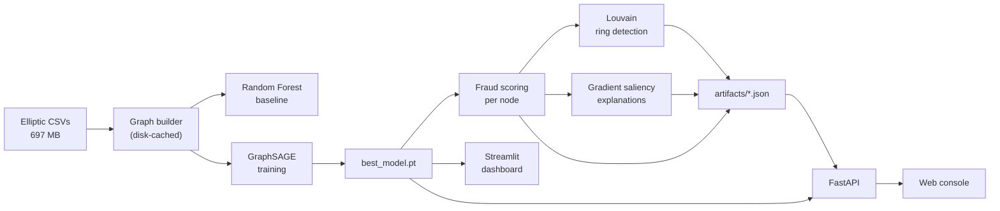

<div align="center">

# FraudLens 🔍

**Graph neural network fraud detection on the Elliptic Bitcoin dataset**

[](https://github.com/tejas-mathangi/fraudlens/actions/workflows/ci.yml)
[](https://www.python.org/)
[](https://pyg.org/)
[](https://fastapi.tiangolo.com/)
[](LICENSE)

Detects fraud at three levels — individual transactions, coordinated **fraud rings**,
and a per-prediction **explanation** of *why* something was flagged.



</div>

---

## The console

A React + TypeScript console over the FastAPI service. Six views, dark and light,
keyboard-searchable by node index **or** real Elliptic `txId`.

| | |
|---|---|
|  |  |
| **Graph explorer** — a connected, fraud-rich slice of the network. Click any node to isolate its 2-hop neighbourhood; everything else dims. | **Fraud rings** — Louvain communities ranked by illicit concentration, each with its induced subgraph and member list. |
|  |  |
| **Explainability** — feature attributions split into local vs neighbourhood features, plus a plain-English verdict: was this flagged for what it did, or for the company it keeps? | **Model** — training curves, precision-recall for both models, and a confusion matrix that highlights false negatives. |

A note on the visual encoding: node colour is the **model's score** on a single-hue ramp,
never the ground-truth label. The obvious `illicit = red / licit = green` pairing was
measured and rejected — it scores ΔE 4.1 under deuteranopia simulation, meaning the two
classes are the same colour to a red-green colourblind reader. Chart identity uses blue
and orange, which clear every contrast and colour-vision gate in both themes. True labels
appear as text-bearing badges, so colour is never the only channel carrying meaning.

---

## Why graph-based?

Traditional fraud detection treats each transaction as an independent row in a table.
Real fraud is **coordinated**: rings of accounts move money between themselves to
launder it. Any single transaction in a ring can look clean — the *network pattern* is
what gives it away.

FraudLens models the transaction network directly:

- **Nodes** — Bitcoin transactions (203,769 of them)
- **Edges** — BTC flow between transactions (234,355)

A 3-layer GraphSAGE encoder means every node aggregates over its 3-hop neighbourhood,
so the model learns that *a clean-looking wallet surrounded by fraudulent wallets is
itself suspicious* — something no tabular model can represent.

---

## Results

| Model | AUC-ROC | F1 (illicit) | Avg precision | Ring detection | Explainability | Inductive |
|---|---|---|---|---|---|---|
| Random Forest (baseline) | **0.9958** | **0.9316** | **0.9807** | ✗ | ✗ | ✗ |
| GraphSAGE (FraudLens) | 0.9885 | 0.8833 | 0.9566 | ✓ | ✓ | ✓ |

**10 fraud rings detected**, including a community that is 97.8% confirmed illicit with
an average fraud score of 0.957.

### The baseline wins on raw metrics — and that's the interesting part

Elliptic ships **72 pre-engineered neighbourhood-aggregate features** alongside each
transaction's 93 intrinsic ones. A Random Forest therefore already consumes a
hand-crafted summary of each transaction's graph context, which is why it scores so
well. GraphSAGE learns that structure from raw topology instead — and in doing so gains
three capabilities that are *architecturally impossible* in a tabular model: it can
cluster coordinated rings, attribute a prediction to specific neighbours and features,
and generalise to transactions it never saw during training.

Reporting the baseline honestly, rather than tuning until the GNN "wins", is the point.

> All numbers in this table are read from `artifacts/metrics.json`, which only the
> pipeline writes. Nothing is hardcoded.

---

## Architecture



### Live mode and artifact mode

The dataset is 697 MB and Kaggle-licensed, so it cannot be committed — which would
normally mean a fresh clone can show nothing at all. Instead, `fraudlens export`
distils the pipeline's output into a few hundred kilobytes of JSON that ships with the
repo, and the API serves **either** source transparently:

| Mode | When | Capability |
|---|---|---|
| **live** | dataset + checkpoint present | score, cluster and explain any of the 203,769 nodes on demand |
| **artifact** | neither present | serve precomputed stats, a fraud-rich graph sample, the top rings and 20 example explanations |

`GET /api/health` reports which mode is active. The HTTP contract is identical in both,
so clients never branch on it.

---

## Quickstart

```bash
git clone https://github.com/tejas-mathangi/fraudlens.git
cd fraudlens
make setup          # venv + dependencies + editable install
```

### Without the dataset — works immediately

```bash
make web            # console on http://localhost:5173
```

The console ships with sample artifacts, so every view renders on a fresh clone. It
displays a persistent **Sample data** banner while those are in use, because the figures
come from a synthetic graph rather than the real Elliptic network.

Add the API if you want the OpenAPI docs too:

```bash
make api            # http://localhost:8000/docs  (starts in artifact mode)
```

### With the dataset — the real thing

```bash
python scripts/download_data.py   # needs Kaggle credentials (~697 MB)
make all                          # EDA -> baseline -> rings -> explain -> export
make api                          # now in live mode
make web                          # banner gone, real numbers
make dashboard                    # optional Streamlit analyst view
```

Training is opt-in because it is slow: `make train`, or `fraudlens all --train`.

### Containers

```bash
docker compose up --build         # console on :8080, API on :8000
```

---

## CLI

One reproducible pipeline, in dependency order:

```bash
fraudlens eda          # dataset statistics and plots
fraudlens baseline     # Random Forest comparison
fraudlens train        # GraphSAGE  (--resume to continue from a checkpoint)
fraudlens rings        # Louvain fraud ring detection
fraudlens explain      # gradient saliency explanations
fraudlens export       # JSON artifacts for the web console
fraudlens all          # everything above (add --train to train from scratch)
```

Every path is environment-overridable, so the dataset can live outside the repo:

```bash
FRAUDLENS_DATA_DIR=/mnt/elliptic fraudlens export
```

See [`.env.example`](.env.example) for the full list.

---

## API

| Endpoint | Returns |
|---|---|
| `GET /api/health` | status, active mode, node/edge counts, thresholds |
| `GET /api/overview` | dataset stats, score distribution, timeline, model comparison |
| `GET /api/nodes/{idx}` | score, prediction, true label, time step, degree, neighbours |
| `GET /api/nodes/{idx}/subgraph` | k-hop neighbourhood, capped for legibility |
| `GET /api/graph/sample` | connected, fraud-rich sample for graph visualisation |
| `GET /api/rings` · `/api/rings/{id}` | ranked rings; ring detail with induced subgraph |
| `GET /api/explain/{idx}` | top feature attributions, edge influences, subgraph |
| `GET /api/explain/candidates` | nodes worth explaining |
| `GET /api/search?q=` | resolve a node index **or** an Elliptic `txId` |

Interactive docs at `/docs`. The console calls these same endpoints and falls back to
`web/public/demo/*.json` when none of them answer, which is what lets the static build
deploy anywhere with no backend at all.

### Frontend stack

| Component | Choice | Why |
|---|---|---|
| Build | Vite + React 18 + TypeScript | fast HMR, no framework server needed for a static deploy |
| Styling | Tailwind CSS v3 + CSS custom properties | tokens live in one file, so both themes swap in one place |
| Charts | Recharts | enough for the seven figures here without a d3 layer to maintain |
| Graph | `react-force-graph-2d` | canvas, handles a few thousand nodes, and pulls in no three.js |
| Icons | lucide-react | tree-shakeable |
| Routing | react-router-dom (hash) | deep links work on static hosts with no server rewrites |

---

## Project structure

```
fraudlens/
├── fraudlens/              # the library
│   ├── config.py           # env-overridable paths + hyperparameter dataclasses
│   ├── data.py             # CSV -> PyG graph, with on-disk caching
│   ├── model.py            # GraphSAGE (3x SAGEConv + BatchNorm + classifier)
│   ├── metrics.py          # evaluation + the metrics.json contract
│   ├── export.py           # the committed demo artifacts
│   ├── cli.py              # `fraudlens <stage>`
│   └── pipeline/
│       ├── eda.py          # dataset exploration
│       ├── baseline.py     # Random Forest
│       ├── train.py        # training loop (fresh + resume)
│       ├── rings.py        # Louvain community detection
│       └── explain.py      # input-gradient saliency
├── api/                    # FastAPI service (live + artifact modes)
│   ├── main.py             # app factory, CORS, background loading
│   ├── state.py            # the live/artifact mode split
│   └── routes.py           # endpoints, identical shapes in both modes
├── web/                    # React + TypeScript console
│   ├── src/lib/api.ts      # API-then-static data layer
│   ├── src/components/     # ui/ charts/ graph/ shell/
│   ├── src/pages/          # one file per route
│   └── public/demo/        # sample artifacts for the static demo
├── dashboard/              # Streamlit analyst dashboard
├── tests/                  # 69 tests, all on synthetic fixtures
├── scripts/                # dataset download, sample-artifact generation
├── artifacts/              # generated JSON (committed)
├── docs/                   # screenshots, UML, architecture notes
├── notebooks/              # generated plots
├── data/                   # Elliptic CSVs (not tracked)
└── models/                 # checkpoints (not tracked)
```

---

## Design decisions

**GraphSAGE over GCN.** GraphSAGE is inductive: it generalises to nodes it never saw
during training. GCN is transductive and needs retraining when the graph grows. For a
system that sees new transactions daily, that difference is the whole ballgame.

**Weighted loss (illicit ≈ 5.1×).** The labelled set is ~1:9 illicit:licit.
Unweighted, the model scores ~90% accuracy by calling everything licit — useless.
Weighted cross-entropy makes a missed fraud roughly five times costlier than a false
alarm. Accuracy is deliberately never reported.

**Louvain on topology, not embeddings.** Communities are detected on the raw
transaction graph, so a "ring" reflects actual money movement rather than learned
feature similarity. The GNN's scores then decide which real communities are worth
reporting — a community is promoted only when it is ≥3 nodes, >40% confirmed illicit,
averages >0.4 fraud score, and contains ≥2 confirmed illicit nodes.

**Gradient saliency for explanations.** For a flagged node we backpropagate the
predicted-class probability into the input features of its 2-hop subgraph and read off
`|∂p/∂x|`. This is faithful to the actual computation rather than a learned post-hoc
approximation. The trade-off is that it reports *sensitivity*, not a minimal sufficient
subgraph — so this is **gradient saliency, not** Ying et al.'s GNNExplainer, and the
code no longer claims otherwise.

**Caching as a design constraint.** Parsing the 658 MB feature CSV takes ~30 s and
Louvain on the full graph takes 1–2 minutes. Both are cached (`.cache/graph.pt`,
`.cache/partition.json`), keyed on the source files' fingerprint. Without this an
interactive UI is not viable.

---

## Dataset

**Elliptic Bitcoin Transaction Dataset** — [Kaggle](https://www.kaggle.com/datasets/ellipticco/elliptic-data-set)

| Property | Value |
|---|---|
| Transactions (nodes) | 203,769 |
| Edges | 234,355 |
| Features per node | 165 (93 local + 72 neighbourhood-aggregated) |
| Time steps | 49 |
| Illicit | 4,545 (2.2%) |
| Licit | 42,019 (20.6%) |
| Unknown | 157,205 (77.1%) |

Not redistributed here (Kaggle licence). Run `python scripts/download_data.py`.

---

## Development

```bash
make test       # pytest — runs without the dataset, on synthetic fixtures
make lint       # ruff
make typecheck  # tsc --noEmit on the console
make web-build  # production bundle
make sample     # regenerate the synthetic demo artifacts
```

`tests/test_model.py` pins the checkpoint's `state_dict` key set: `best_model.pt` is a
bare state dict, so the layer attribute names are an on-disk contract and a rename
would silently break every saved model.

---

## Roadmap

- [x] React + TypeScript console on top of the API
- [x] Docker Compose for one-command local startup
- [ ] Temporal split evaluation (train on early time steps, test on later ones) — the
      current random split lets the model see the same time period in train and test,
      which flatters it relative to how fraud detection actually runs
- [ ] Attention-based aggregation (GAT) comparison
- [ ] Hosted demo of the static console

---

## Academic context

A research implementation for a Real-Time Research Project (B.Tech CSE AI/ML, JNTUH),
grounded in:

- Hamilton et al. (2017) — *Inductive Representation Learning on Large Graphs* (GraphSAGE)
- Weber et al. (2019) — *Anti-Money Laundering in Bitcoin* (the Elliptic dataset)
- Blondel et al. (2008) — *Fast unfolding of communities in large networks* (Louvain)
- Ying et al. (2019) — *GNNExplainer* (inspiration; this repo implements gradient saliency)

---

## Author

**Tejas Mathangi** — B.Tech CSE (AI & ML), JNTUH Hyderabad

[GitHub](https://github.com/tejas-mathangi) · [LinkedIn](https://linkedin.com/in/tejas-mathangi)

Licensed under the [MIT License](LICENSE).
