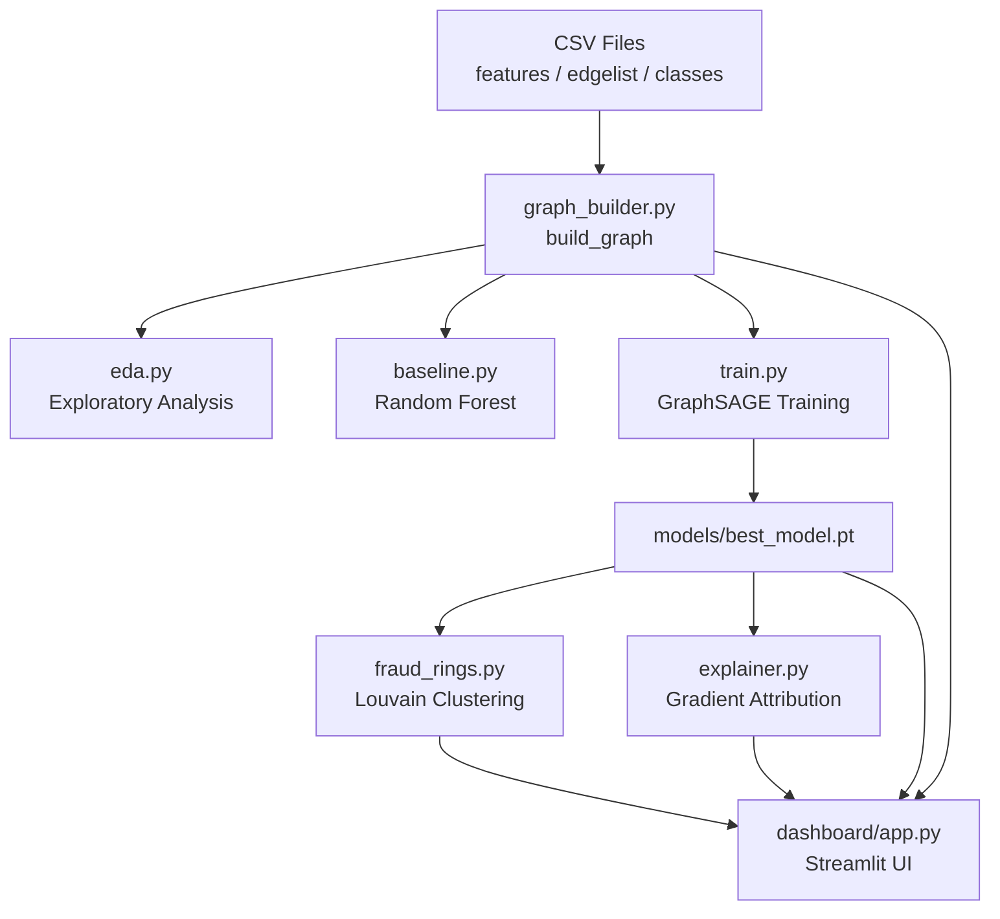

# 🔍 FraudLens — Codebase Breakdown

## What Is This Project?

**FraudLens** is an end-to-end **Graph Neural Network (GNN) fraud detection system** built on the **Elliptic Bitcoin Transaction Dataset**. It detects fraudulent Bitcoin transactions by treating them as nodes in a graph, then using GraphSAGE to classify each node as *licit* or *illicit*, detect coordinated *fraud rings*, and explain *why* a node was flagged.

---

## High-Level Architecture

```
Raw CSV Data  →  Graph Builder  →  GNN Model  →  Fraud Rings  →  Explainer
                                        ↕
                              Streamlit Dashboard (app.py)
```

---

## 📁 Folder Structure

| Folder | Role |
|---|---|
| `data/` | Raw dataset CSVs (not git-tracked, ~700 MB) |
| `src/` | All core pipeline Python modules |
| `models/` | Saved trained model weights |
| `notebooks/` | Output plots from pipeline runs |
| `dashboard/` | Interactive Streamlit web app |

---

## 📂 `data/elliptic_bitcoin_dataset/`

Three raw CSV files from the [Elliptic Bitcoin Dataset](https://www.kaggle.com/datasets/ellipticco/elliptic-data-set):

| File | Size | Contents |
|---|---|---|
| `elliptic_txs_features.csv` | ~658 MB | 203,769 transactions × 165 features + txId + time_step |
| `elliptic_txs_edgelist.csv` | ~4.3 MB | Directed edges (BTC flow) between transactions |
| `elliptic_txs_classes.csv` | ~3.2 MB | Labels: `1`=illicit, `2`=licit, `unknown` |

**Dataset stats:**
- ~203K total nodes, ~234K edges, 49 time steps
- ~4,545 illicit (~2.2%), ~42,019 licit, ~157K unknown
- Severe class imbalance: ~1:9 fraud ratio among labeled

---

## 📂 `src/` — Core Pipeline

### [`graph_builder.py`](file:///Users/200574/Desktop/TEJ/fraudlens/src/graph_builder.py)
**Purpose:** Load the raw CSVs and build a PyTorch Geometric `Data` object.

**Key steps:**
1. Load all 3 CSVs into pandas DataFrames
2. Create `node_to_idx` mapping (txId → integer 0..N)
3. Build `X` feature matrix `[203769, 165]`
4. Build `edge_index` tensor `[2, n_edges]` in PyG format
5. Encode labels: illicit=1, licit=0, unknown=-1
6. Create `label_mask` (True for labeled nodes only)
7. Return `(data, label_mask, node_to_idx)` — used by every other module

---

### [`model.py`](file:///Users/200574/Desktop/TEJ/fraudlens/src/model.py)
**Purpose:** Define the **GraphSAGE** neural network architecture.

**Architecture:**
```
Input (165 features)
  → SAGEConv(165 → 128) + BatchNorm + ReLU + Dropout(0.3)
  → SAGEConv(128 → 128) + BatchNorm + ReLU + Dropout(0.3)
  → SAGEConv(128 → 64)  + BatchNorm + ReLU + Dropout(0.3)
  → Linear(64 → 2)
  → Output: [licit_logit, illicit_logit]
```

**Why 3 layers?** Each layer aggregates from one more hop of neighbors. With 3 layers, each node "sees" up to 3 hops away — enough to capture fraud ring structure.

**Key methods:**
- `forward(x, edge_index)` → class logits
- `get_embeddings(x, edge_index)` → pre-classifier node embeddings (used for Louvain clustering)

---

### [`eda.py`](file:///Users/200574/Desktop/TEJ/fraudlens/src/eda.py)
**Purpose:** Exploratory Data Analysis — run once to understand the dataset.

**What it does:**
- Prints shape, time step range, class distribution, edge stats
- Generates `notebooks/eda_plots.png` with 3 plots:
  1. Bar chart of class distribution (illicit / licit / unknown)
  2. Line chart: illicit & licit transactions per time step
  3. Feature correlation heatmap (first 20 features)

**Run standalone:** `python src/eda.py`

---

### [`baseline.py`](file:///Users/200574/Desktop/TEJ/fraudlens/src/baseline.py)
**Purpose:** Train a **Random Forest classifier** as a non-graph baseline to benchmark against.

**What it does:**
1. Extracts only labeled nodes' feature vectors (no graph structure)
2. Trains `RandomForestClassifier(n_estimators=100, class_weight='balanced')`
3. Evaluates: AUC-ROC, F1 (illicit), Average Precision, Confusion Matrix
4. Prints top-10 feature importances
5. Saves `notebooks/baseline_plots.png` (Precision-Recall curve + feature importances)

**Baseline results (hardcoded for comparison):**
- AUC-ROC: **0.9958**, F1: **0.9316**, Avg Precision: **0.9807**

> The RF ignores graph structure. The goal is for GraphSAGE to justify the extra complexity by adding fraud ring detection & explainability even if raw metrics are similar.

---

### [`train.py`](file:///Users/200574/Desktop/TEJ/fraudlens/src/train.py)
**Purpose:** Full **GraphSAGE training pipeline**.

**Key functions:**
- `get_train_test_masks()` — stratified 80/20 split on labeled nodes
- `compute_class_weights()` — upweights illicit class to handle 1:9 imbalance
- `evaluate()` — computes loss, AUC, F1, Avg Precision on any mask
- `train()` — main training loop:
  1. Loads graph via `build_graph()`
  2. Creates train/test split
  3. Initializes GraphSAGE (165 → 128 → 128 → 64 → 2)
  4. Adam optimizer (lr=0.001) + ReduceLROnPlateau scheduler
  5. 200 epochs with early stopping (patience=30)
  6. Saves best model to `models/best_model.pt`
  7. Final eval on test set + comparison vs RF baseline
  8. Saves `notebooks/training_plots.png` (F1 & Loss curves)

**Trained model results:** AUC ~0.9885, F1 ~0.8833

---

### [`train_more.py`](file:///Users/200574/Desktop/TEJ/fraudlens/src/train_more.py)
**Purpose:** **Resume training** from the saved checkpoint for additional epochs.

- Loads `models/best_model.pt`
- Continues training for 300 more epochs (lower lr=0.0005)
- Saves updated checkpoint if improved
- Useful for squeezing out more performance without restarting from scratch

---

### [`fraud_rings.py`](file:///Users/200574/Desktop/TEJ/fraudlens/src/fraud_rings.py)
**Purpose:** Detect **coordinated fraud rings** using Louvain community detection.

**Pipeline:**
1. Load trained model, compute fraud probability scores for all nodes
2. Build a NetworkX graph from `edge_index`
3. Run **Louvain algorithm** (`community.best_partition`) to find communities
4. For each community:
   - Compute illicit ratio & avg fraud score
   - Flag as a **fraud ring** if: illicit ratio > 40% AND avg score > 0.4 AND ≥2 illicit nodes
5. Rank fraud rings by illicit ratio
6. Visualize: histogram of illicit ratios + subgraph of top fraud ring (nodes colored red=illicit, green=licit, orange=unknown)
7. Saves `notebooks/fraud_rings.png`

---

### [`explainer.py`](file:///Users/200574/Desktop/TEJ/fraudlens/src/explainer.py)
**Purpose:** **Explain why** a node was predicted as fraudulent using gradient-based attribution.

**`explain_node(model, data, node_idx)`:**
1. Extracts the 2-hop subgraph around the node
2. Computes **gradient of prediction** w.r.t. input features → feature importance mask
3. Computes **edge importance** based on neighbor fraud scores
4. Returns: `(edge_mask, feature_mask, subgraph, ...)`

**`run_explainer()`:**
- Picks top-3 confident illicit + 1 licit node from test set
- Runs `explain_node` on each
- Visualizes 4 explanation subgraphs (edges colored by importance)
- Reports top-10 most influential features per node
- Saves `notebooks/explanations.png`

---

### [`__init__.py`](file:///Users/200574/Desktop/TEJ/fraudlens/src/__init__.py)
Empty — makes `src/` a Python package so imports like `from src.model import GraphSAGE` work.

---

## 📂 `models/`

| File | Contents |
|---|---|
| `best_model.pt` | Saved PyTorch state dict (~370 KB) — best GraphSAGE weights by val F1 |

---

## 📂 `notebooks/`

Pre-generated plots from running the pipeline:

| File | Generated by | Contents |
|---|---|---|
| `eda_plots.png` | `eda.py` | Class distribution, transactions per time step, feature correlations |
| `baseline_plots.png` | `baseline.py` | Precision-Recall curve, RF feature importances |
| `training_plots.png` | `train.py` | Train/Val F1 + Loss curves over epochs |
| `fraud_rings.png` | `fraud_rings.py` | Community illicit ratio distribution + top fraud ring subgraph |
| `explanations.png` | `explainer.py` | 4-panel GNN explanation subgraphs |

---

## 📂 `dashboard/`

### [`app.py`](file:///Users/200574/Desktop/TEJ/fraudlens/dashboard/app.py)
**Purpose:** Interactive **Streamlit web dashboard** — the UI layer over the entire pipeline.

**Structure:** Single-file Streamlit app with 4 pages (selected via sidebar radio):

#### Page 1: 📊 Overview
- Key metrics: total nodes, edges, illicit count, high-risk nodes, model AUC
- Class distribution bar chart
- Fraud score distribution histogram (licit vs illicit)
- Model comparison table (RF vs GraphSAGE)
- Avg fraud score per time step line chart

#### Page 2: 🔎 Node Inspector
- Enter any node index (0–203,768)
- Shows: fraud score, prediction (FRAUD/CLEAN), true label, progress bar
- Neighbor table (up to 20 neighbors) with their scores and labels
- 2-hop neighborhood graph (nodes colored by label/score)

#### Page 3: 💀 Fraud Rings
- Runs Louvain detection live (with spinner)
- Displays detected fraud rings in a sortable table
- Dropdown to select any ring and visualize its subgraph

#### Page 4: 🧠 Explainer
- Enter a node index; click "Explain"
- Shows explanation subgraph (edges colored by influence strength)
- Shows top-15 features driving the prediction with a bar chart
- Interprets whether prediction is driven by local features or neighborhood

**Caching:** `@st.cache_resource` on `load_everything()` so the graph+model only loads once per session.

> **Note:** There's a small bug on line 580 — `feat_types` should be `feat_type` (variable name typo).

---

## 🔗 How Everything Connects



---

## ⚙️ Tech Stack

| Library | Used for |
|---|---|
| `torch` + `torch_geometric` | GraphSAGE model, PyG Data objects |
| `pandas` + `numpy` | CSV loading, array math |
| `scikit-learn` | Train/test split, metrics, Random Forest baseline |
| `networkx` + `python-louvain` | Graph construction, community detection |
| `matplotlib` + `seaborn` | All plots |
| `streamlit` | Interactive dashboard |

---

## 🚀 Run Order (from scratch)

```bash
# 1. Explore the data
python src/eda.py

# 2. Train baseline
python src/baseline.py

# 3. Train GraphSAGE
python src/train.py

# 4. (Optional) More training
python src/train_more.py

# 5. Detect fraud rings
python src/fraud_rings.py

# 6. Generate explanations
python src/explainer.py

# 7. Launch dashboard
streamlit run dashboard/app.py
```
